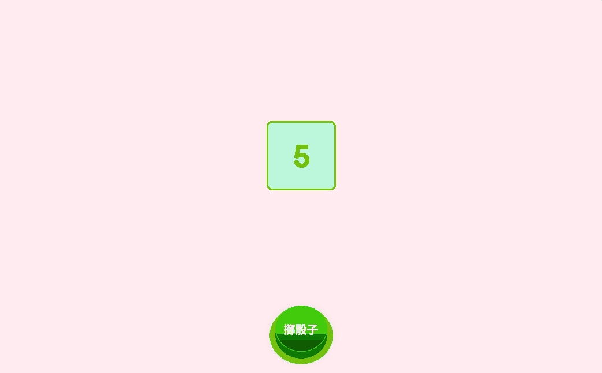

# Simulate_3D_dice_rolling_animation.js
盡量使用較少的程式碼模擬擲 3D 骰子的動畫演出( JavaScript 版本，附上完整註解說明)

---

# 檔案說明
- package.json
如果你有用到 npm 套件或想讓專案更容易被管理、部署，建議加入 package.json。
- .editorconfig
用來統一不同編輯器的縮排、換行等格式設定，建議加入 - .editorconfig。
- .eslintrc.json 或 .eslintrc.js
如果你想要統一 JavaScript 程式碼風格，可以加入 ESLint 設定檔。
- .prettierrc
用於自動格式化程式碼的 Prettier 設定檔。
- favicon.ico
網站小圖示，可放在根目錄並於 HTML <head> 加入連結。

---

PS. 已知 BUG，第一次擲骰子時，骰子旋轉會比較慢，之後就正常了，之後會花時間解此 BUG

